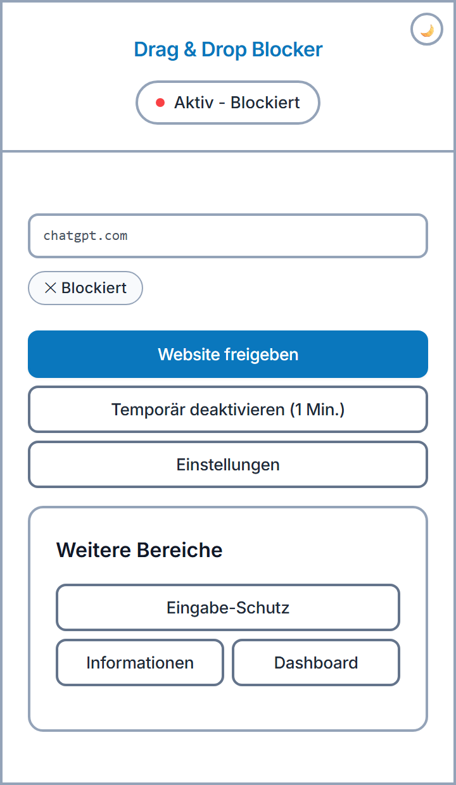
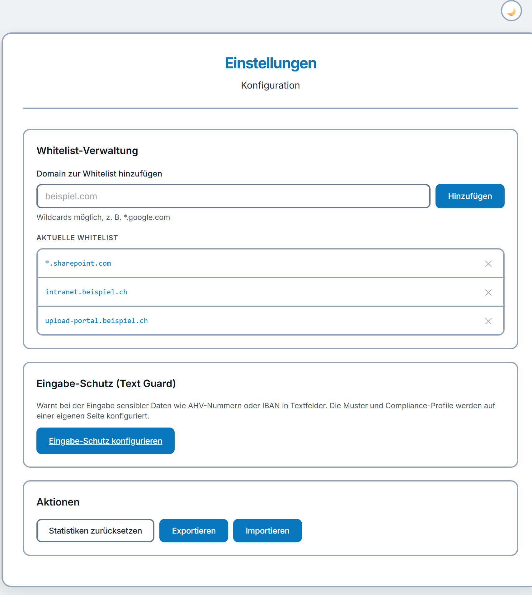
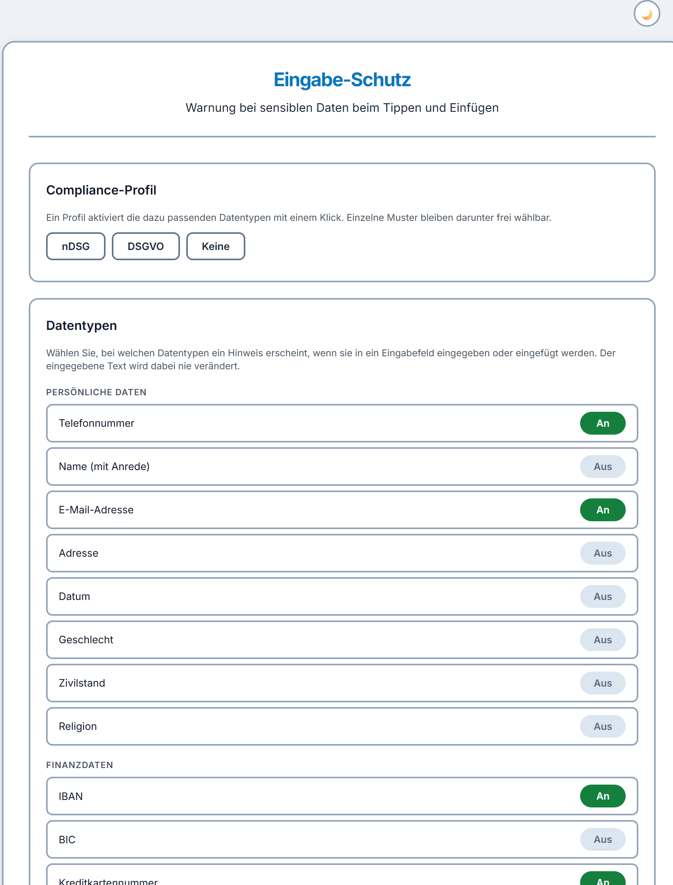
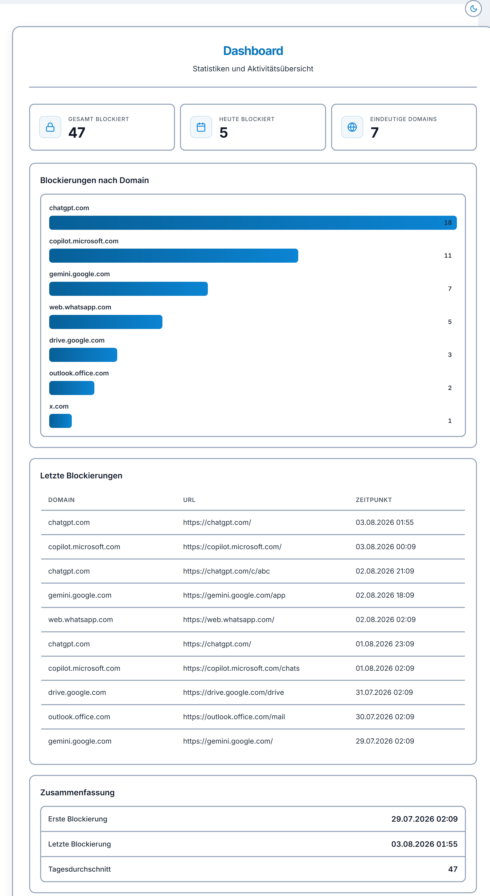
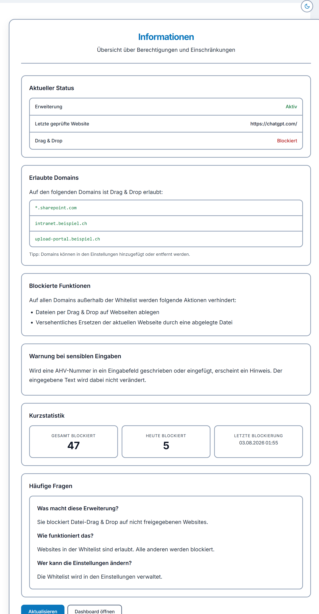
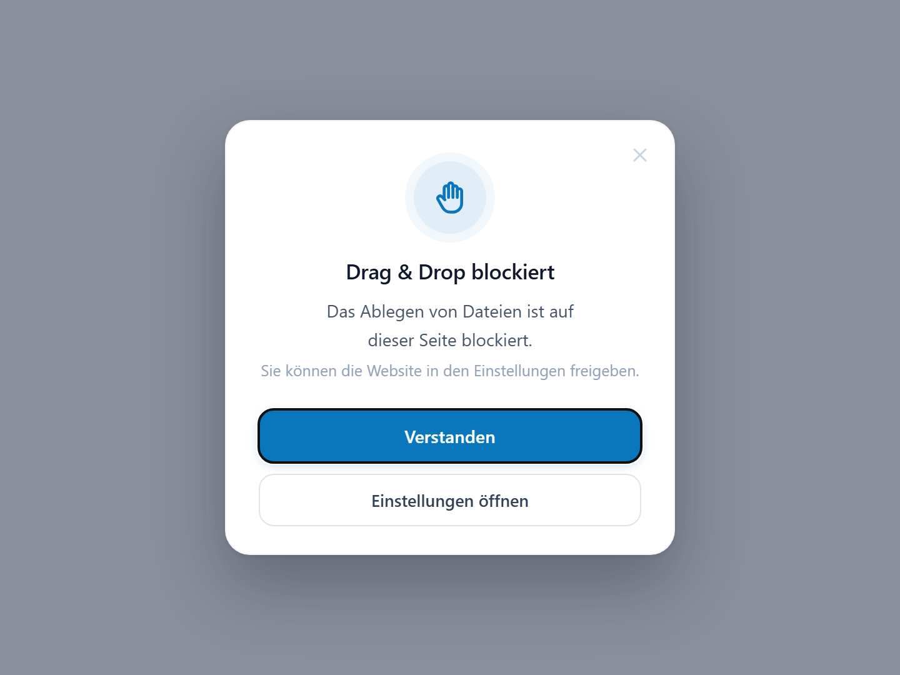
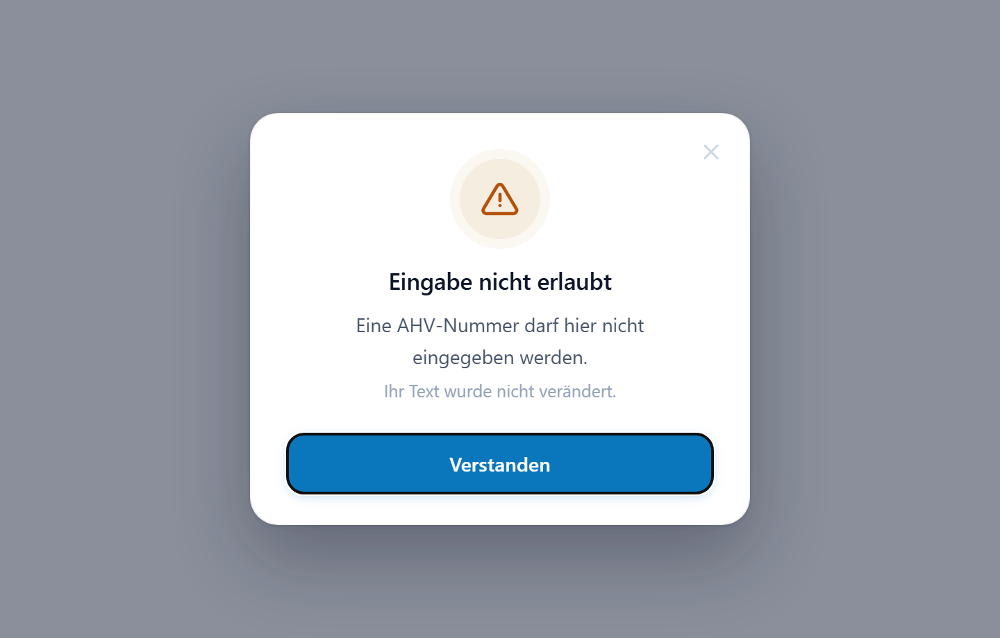

# Drag & Drop Blocker

Browser-Erweiterung, die verhindert, dass Dateien **versehentlich per Drag & Drop** auf fremde Websites gezogen werden. Zusätzlich warnt sie, wenn **sensible Daten** wie AHV-Nummern oder IBAN in Textfelder eingegeben oder eingefügt werden.

> Entwickelt während meines Praktikums. Die Screenshots zeigen Beispieldaten.

## Was das Tool macht

- **Drag & Drop blockieren:** Auf allen Websites, die nicht auf der Whitelist stehen, können keine Dateien abgelegt werden. Auch das versehentliche Ersetzen der aktuellen Seite durch eine abgelegte Datei wird verhindert.
- **Whitelist:** Erlaubte Domains lassen sich verwalten, Wildcards wie `*.sharepoint.com` sind möglich. Eine Website kann direkt aus dem Popup freigegeben werden. Der Schutz lässt sich auch für eine Minute temporär deaktivieren.
- **Eingabe-Schutz (Text Guard):** Warnt bei Telefonnummer, E-Mail-Adresse, IBAN, Kreditkartennummer, AHV-Nummer und weiteren Datentypen. Der eingegebene Text wird dabei nie verändert.
- **Compliance-Profile:** nDSG und DSGVO aktivieren die passenden Datentypen mit einem Klick, einzelne Muster bleiben frei wählbar.
- **Dashboard:** Statistik der Blockierungen nach Domain, letzte Ereignisse und Zusammenfassung.
- **Export und Import** der Einstellungen sowie ein dunkles Design.

## Screenshots

### Popup
Status der aktuellen Website mit Schnellaktionen.

### Einstellungen
Whitelist-Verwaltung, Eingabe-Schutz und Aktionen.

### Eingabe-Schutz
Compliance-Profile und Auswahl der Datentypen.

### Dashboard
Statistiken und Aktivitätsübersicht.

### Informationen
Übersicht über Status, Berechtigungen und Einschränkungen.

### Hinweise für Benutzer
Meldung bei blockiertem Drag & Drop und bei geschützten Eingaben.

